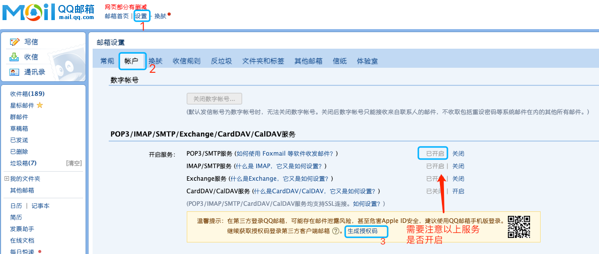

# jjsign

## 使用

### fork 我的项目

在项目 `settings => secrets` 添加 `JUEJIN_COOKIE` 字段，设置值为`掘金 cookie`，设置好可以手动触发一次，验证是否正确，下次就会定时触发了，再也不用担心签到了。

> `掘金 cookie` 好像一个月内有效，退出登录后也无效，需要及时更换 `cookie`。


如图所示，就成功了。


**获取 `掘金 cookie` 方法**

[打开这个页面，登录后，按 F12 打开开发者工具，刷新页面](https://juejin.cn/user/center/signin?from=avatar_menu)

在 `fetch/xhr` 搜索过滤 `get_today_status` 这个接口，在 `Request Headers` 中复制 `cookie` 的值。如下图所示：


#### 开启邮箱发送日志的服务

在项目 `settings => secrets` 中需要额外添加以下字段

|           字段名 | 含义                             | 默认值      |
| ---------------: | :------------------------------- | ----------- |
|      MAIL_SENDER | 发送方邮箱                       | -           |
|    SMTP_PASSWORD | 发送方 SMTP 服务的授权码或者口令 | -           |
| MAIL_HOST_SENDER | 发送邮件服务器                   | smtp.qq.com |
| MAIL_PORT_SENDER | 发送邮件服务器的端口号           | 465         |
|   MAIL_RECIPIENT | 邮件接受方                       | -           |

以 QQ 邮箱为例



|           字段名 | 举例                   |
| ---------------: | :--------------------- |
|      MAIL_SENDER | xxx@qq.com（自己邮箱） |
|    SMTP_PASSWORD | 上图获取的授权码       |
| MAIL_HOST_SENDER | smtp.qq.com            |
| MAIL_PORT_SENDER | 465                    |
|   MAIL_RECIPIENT | xxx@qq.com（自己邮箱） |

### 新建项目或者已有项目

添加 `.github/workflows/main.yml` 文件，其中 `main` 可以自定义成其他名称。

```yml
on:
  push:
  schedule:
    # 定时任务 每天 8:00 自动签到，按照计划任务队列，可能延迟 0 + 8 = 北京时间 8
    - cron: '00 0 * * *'

jobs:
  juejin:
    runs-on: ubuntu-latest
    name: 掘金自动签到
    steps:
      - name: Hello world action step
        id: hello
        uses: liejiayong/jjsign@main
        env:
          JUEJIN_COOKIE: ${{secrets.JUEJIN_COOKIE}}
        with:
          who-to-greet: 'JyLie'
      # Use the output from the `hello` step
      - name: Get the output
        run: |
          echo "The time was ${{ steps.hello.outputs.time }}"
          echo "签到结果： ${{ steps.hello.outputs.checkInResult }}"
```

同样在项目 `settings => secrets` 添加 `JUEJIN_COOKIE` 字段，设置值为`掘金 cookie`。

## 本地开发

```bash
# git clone https://github.com/liejiayong/jjsign.git
npm i -g pnpm
pnpm install

# 提交 commit 消息用以下命令，使用了（git-cz）
pnpm run commit
# npm run commit
```

## 本地测试

在 `test/env.js` 文件代码配置相应配置。

```bash
npm run test
```

## TODOs

- [x] 根据 `cookie` 自动签到
- [x] 邮件通知
- [ ] 加入每天免费抽奖功能
- [ ] 加入 eslint
- [ ] 加入 .env 文件
